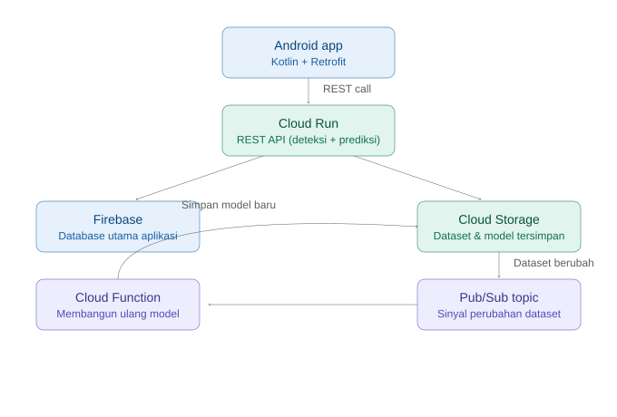

# RiceUp – Crop Yield Prediction & Disease Control System

Cloud infrastructure and API layer for a mobile app that helps Indonesian rice farmers detect plant diseases from photos and predict crop yield — built as a Bangkit / product-based capstone project (Team C242-PS263).

> 📌 This repository documents my Cloud Computing contribution to a 7-person, 3-track capstone team (Machine Learning, Cloud Computing, Mobile Development). The ML models and Android app were built by teammates on the ML and MD tracks — see [Team & Credits](#team--credits) below. Full team repository: [C242-PS263](https://github.com/C242-PS263).

## Overview

Rice is Indonesia's staple crop, but farmers regularly lose yield to undiagnosed plant disease and have no reliable way to forecast harvest output. RiceUp addresses both: a CNN model detects and grades disease severity from a photo taken in the field, and a regression model predicts expected yield from inputs like land area, rainfall, temperature, and planting distance — both surfaced through a native Android app.

## Problem

Farmers had no accessible tool combining disease diagnosis with yield forecasting, and existing public datasets for yield prediction didn't include disease-history data — a gap the team had to work around during model development (a ML-side constraint, noted here for context).

## My Role

Cloud Computing (2-person track, alongside a teammate), within a 7-person capstone team over a 4-week sprint.

## My Contributions

- **Set up the Google Cloud project infrastructure** the whole team built on: Cloud Storage buckets for datasets and trained models, initial API endpoints, and IAM/resource configuration.
- **Built the REST API layer on Cloud Run** that serves the disease-detection and yield-prediction models to the Android app — the single integration point between the ML team's models and the Mobile team's UI.
- **Set up Firebase as the app's primary database**, chosen so the mobile app could read/write data directly without an extra backend hop.
- **Implemented an event-driven retraining pipeline**: a Pub/Sub topic fires whenever the training dataset changes, and a Cloud Function subscribed to that topic automatically rebuilds the model — so the model can be refreshed without a manual redeploy.
- **Tested and refined API performance** for real-time response times, working from dummy data through to real model outputs as the ML models matured.

## System Architecture

- **Cloud Run**: hosts the REST API that the Android app calls for disease detection and yield prediction.
- **Cloud Storage**: holds training datasets and versioned model artifacts.
- **Pub/Sub + Cloud Functions**: event-driven retraining — a dataset change publishes to a topic, a subscribed Cloud Function rebuilds the model.
- **Firebase**: primary application database, accessed directly by the mobile app.
- **Android app (Kotlin + Retrofit)**: calls the Cloud Run API and renders results — built by the Mobile Development track.

## Technologies

Google Cloud Run · Cloud Storage · Cloud Functions · Pub/Sub · Firebase · REST API · Google Cloud SDK · Google Cloud Console

## Team & Credits

7-person team, Team ID C242-PS263:
- **Machine Learning**: Syarif Hidayatullah, Bintang Febriano Kadarusman, Mifdhal Rafinanda — TensorFlow/Keras CNN for disease detection, regression model for yield prediction.
- **Cloud Computing**: myself and a teammate — infrastructure, API, and the retraining pipeline described above.
- **Mobile Development**: Namira Nurpatimah, Kenedy Ale Jeri Pratama — native Android app in Kotlin, UI in Figma.

## Results / Impact

- Delivered a working end-to-end pipeline — ML model → Cloud Run API → Android app — within a 4-week capstone sprint.
- The retraining pipeline meant the disease-detection model could be updated as the dataset improved without a manual redeploy cycle.
- Final deliverables included a published Android app bundle, GitHub repository with documentation, and a project presentation to Bangkit mentors.

## Project Documentation

Official capstone Project Plan document — available on request. Team repository and full documentation: [github.com/C242-PS263](https://github.com/C242-PS263).
